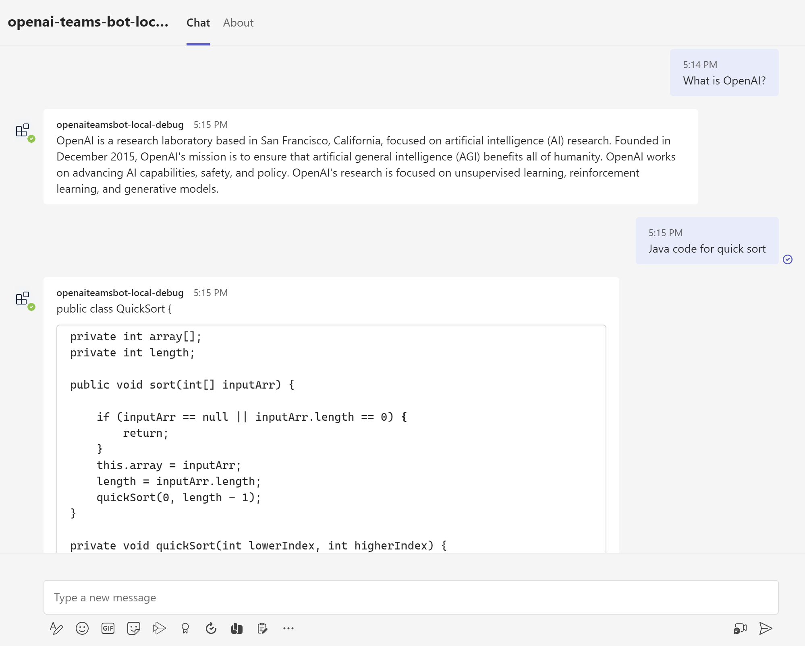

# OpenAI-Features
Hello! Here you will find interesting links to understand OpenAI more and how you can use it in business.

The themes which present here with links below:
* OpenAI Teams Bot app
* Teams OpenAI Conversation Bot
* Azure Open AI with Power Apps
* Fine Tuning GPT-3: Building a Custom Q&A Bot Using Embeddings
* AI training: 5 Easy Ways to Train a Chatbot
* Perfect Youtube chanel - Tinkering with Deep Learning & AI
* How to make sure answers are from customized (fine-tuning) dataset

## OpenAI Teams Bot app ##
[Here](https://github.com/formulahendry/openai-teams-bot) you will find how to connect OpenAI API with Microsoft Teams creating an application using NodeJS and Typescript as main programming languages.
The tools which will be needed are subscription to Microsoft365, Teams Toolkit for VSCode and Azure to deploy your Bot in network.

## Teams OpenAI Conversation Bot ##
[Here](https://github.com/pnp/teams-dev-samples/tree/main/samples/bot-openai) is the improved version of previous project.
This version allows to use Teams as full conversation bot, it remembers your previous responses to interact not only message-by-response as ChatGPT.

## Azure Open AI with Power Apps ##
[Here](https://medium.com/mlearning-ai/azure-open-ai-with-power-apps-89c72577ba65) is interesting article about integration PowerApps with Azure OpenAI service which tells how to create HTTP requests with JSON body with question to call Azure service API by endpoint.

## Fine Tuning GPT-3: Building a Custom Q&A Bot Using Embeddings ##

In [this article](https://www.mlq.ai/fine-tuning-gpt-3-question-answer-bot/) you will find the common definition of embeddings and how to manage it using Python.
GPT model didnt have data about events which happened after 2020. So, the author train and embed model to get the response to question which GPT doesnt know.

## AI training: 5 Easy Ways to Train a Chatbot ##

The name of [the article]() speaks for itself, you will know the main points of workflow of fine-tuning language models.
Why you have to not only put a lot of data to model, why you should embed and validate it.

## Perfect Youtube chanel - Tinkering with Deep Learning & AI ##

The author of this chanel tells really useful information about fine-tuning in Azure OpenAI Service and common OpenAI API.

## Customize (fine-tune) OpenAI model: How to make sure answers are from customized (fine-tuning) dataset ##

The OP started very interesting thread, asking about what is embeddings and how to manage it.

